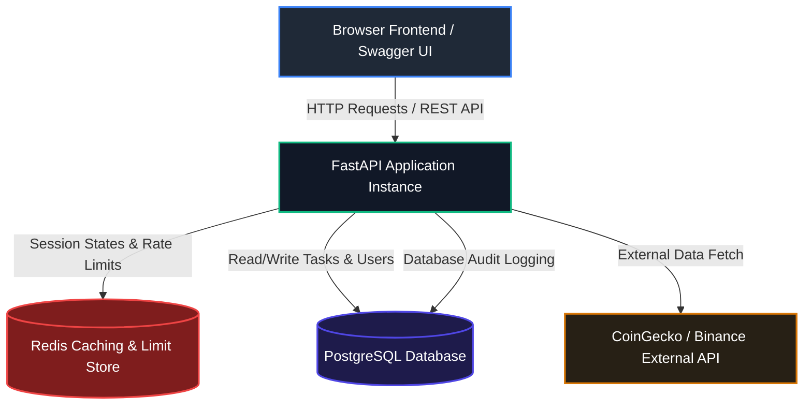

# ⚡ PrimeTrade.ai - Scalable REST API & Interactive Dashboard

[](https://fastapi.tiangolo.com)
[](https://www.postgresql.org)
[](https://redis.io)
[](https://www.docker.com)
[](https://jwt.io)

An industry-grade, highly scalable backend ecosystem designed for the **Primetrade.ai Hiring Assignment**. The application features a robust FastAPI REST backend, a relational PostgreSQL database, Redis-backed rate limiting and high-speed caching, strict JWT-based session handling, a self-healing database schema, and an ultra-clean Charcoal/Midnight-Slate interactive frontend dashboard to demonstrate all system capabilities without needing external clients.

---

## 📋 Assignment Requirements & Implementation Mapping

This table maps each requirement specified in **Sonika's Primetrade.ai Backend Developer Internship Assignment** to our complete implementation:

| Requirement Category | Specific Assignment Goal | Implementation Status | Repository Technical Reference |
| :--- | :--- | :--- | :--- |
| **Backend Core** | User registration & login | ✅ **100% Implemented** | `POST /api/v1/auth/register` & `POST /api/v1/auth/login` |
| | Password hashing | ✅ **100% Implemented** | `passlib` context utilizing the robust `bcrypt` hashing algorithm |
| | JWT authentication | ✅ **100% Implemented** | Short-lived Access Token + secure, `HTTPOnly`, `SameSite=Lax` Refresh Cookie |
| | Role-based access control | ✅ **100% Implemented** | `user` vs `admin` roles; route auth validations (`current_user.role == "admin"`) |
| | CRUD APIs for secondary entity | ✅ **100% Implemented** | Complete, owner-isolated task management `/api/v1/tasks` endpoints |
| | API versioning | ✅ **100% Implemented** | Explicit namespace version routing at `/api/v1/...` |
| | Error handling & validation | ✅ **100% Implemented** | Pydantic v2 schemas for strict payload validation + FastAPI Exception handlers |
| | API documentation | ✅ **100% Implemented** | Live, interactive Swagger UI served at `/docs` & ReDoc served at `/redoc` |
| | Database schema | ✅ **100% Implemented** | Relational multi-table Postgres schema (SQLAlchemy 2.0 ORM + Alembic) |
| **Supportive UI** | Registration & Login forms | ✅ **100% Implemented** | Frictionless centered single-page credentials switcher card |
| | Protected Dashboard | ✅ **100% Implemented** | Single-Page dashboard served at `/` requiring active JWT authentication session |
| | Task CRUD Actions | ✅ **100% Implemented** | Seamless inline edit fields, interactive dropdown status badges, red danger buttons |
| | Success/Error Responses | ✅ **100% Implemented** | Bottom-right Toast popups (Green for successful operations, Red for API errors) |
| **Security & Scale**| Secure JWT token handling | ✅ **100% Implemented** | Access token stored in memory, CSRF protected secure refresh cookie |
| | Input validation | ✅ **100% Implemented** | strict field filters + injection-safe parametrizations via SQLAlchemy ORM |
| | Scalable architecture | ✅ **100% Implemented** | Modular package layers: `core`, `api/routes`, `models`, `schemas`, `services` |
| | Redis Caching | ✅ **100% Implemented** | Cache-aside queries on `GET /tasks` with dynamic cache prefix invalidation |
| | Redis Rate Limiting | ✅ **100% Implemented** | Sliding-window request cap limiting to prevent client rate abuse |
| | Logging & Audit Logs | ✅ **100% Implemented** | DB-backed request logging mapping actor context, IP addresses, and HTTP methods |
| | Docker Deployment | ✅ **100% Implemented** | Multi-container unified orchestrations in `docker-compose.yml` (API + Postgres + Redis) |

---

## 🏗️ System Architecture Flowchart



## 🌐 Project Access Endpoints

### 🚀 Live Production Deployment (24/7 Awake)
* 🖥️ **Live Web Application**: [https://primetrade-ai-k6os.onrender.com/](https://primetrade-ai-k6os.onrender.com/) *(Served dynamically from Render)*
* 📘 **Live Swagger UI API Docs**: [https://primetrade-ai-k6os.onrender.com/docs](https://primetrade-ai-k6os.onrender.com/docs)
* 📕 **Live ReDoc Alternative Docs**: [https://primetrade-ai-k6os.onrender.com/redoc](https://primetrade-ai-k6os.onrender.com/redoc)

### 💻 Local Dev / Docker Environment
* 🖥️ **Local Dashboard UI**: [http://localhost:8000/](http://localhost:8000/) *(Served statically from the backend)*
* 📘 **Local Swagger UI API Docs**: [http://localhost:8000/docs](http://localhost:8000/docs)
* 📕 **Local ReDoc Alternative Docs**: [http://localhost:8000/redoc](http://localhost:8000/redoc)
* 💚 **API Health Check**: [http://localhost:8000/health](http://localhost:8000/health)

## 🚀 Quick Start Guide (Docker Compose)

The entire stack is pre-configured to run out of the box using Docker. You do not need to install local PostgreSQL or Redis servers!

### 1. Copy Environment Configuration
```bash
cp .env.example .env
```

### 2. Launch the Application Stack
```bash
docker compose up --build -d
```
*This command compiles the FastAPI container, spins up PostgreSQL and Redis instances, conducts startup health checks, performs database schema setups, and seeds the default administrator.*

### 🔑 Seeded Administrator Login
To verify administrative access, the database is pre-populated with:
* **Email Address**: `admin@example.com`
* **Password**: `Admin12345!`
*Logging in as the admin unlocks the **Admin Panel** at the bottom of the dashboard page, displaying all registered users.*

---

## 🔧 Alternative Local Execution (No Docker)

If you prefer to run the application directly on your host machine:

### 1. Configure the Environment
Ensure you have running instances of PostgreSQL and Redis. Edit `.env` and set:
```env
DATABASE_URL=postgresql://<user>:<password>@localhost:5432/<db_name>
REDIS_URL=redis://localhost:6379
```

### 2. Install Project Dependencies
```bash
pip install -r requirements.txt
```

### 3. Start the Web Server
```bash
uvicorn app.main:app --reload
```

---

## 🧪 Comprehensive Automated Testing

A highly detailed test suite is included, covering all components of the assignment:

```bash
pytest -v
```

The tests strictly validate:
* **Authentication**: Password hashing correctness, registration payload checks, JWT access and refresh token cycles.
* **Task CRUD**: Access controls, task ownership separation, search parameters.
* **Performance Enhancements**: Redis rate limit calculations and caching validations.
* **Integrations**: Safe fallback triggers when the external BTC pricing API encounters network timeouts.

---

## 📁 Repository Modular Structure

The project layout follows a strict clean architecture structure, ready to accommodate new domain modules:

```text
primetrade/
│
├── app/
│   ├── api/routes/          # HTTP request routers (auth, tasks, admin, external)
│   ├── core/                # Database engines, Redis cache pipelines, logging, middleware
│   ├── models/              # SQLAlchemy database ORM structures
│   ├── schemas/             # Pydantic schema validation structures
│   ├── services/            # Upstream external price integration helpers
│   └── main.py              # Application lifecycle, startups, and middlewares
│
├── alembic/                 # Alembic version database migrations
├── frontend/                # Interactive UI: index.html, app.js, styles.css
├── tests/                   # Automated Pytest suite
│
├── docker-compose.yml       # Docker orchestrator definition
├── Dockerfile               # High-speed multi-stage backend API builder
└── requirements.txt         # Project python library dependencies
```

---

## 💎 Scalability & Production Architecture Blueprint

To scale this application to serve millions of transactions daily, the following architecture can be deployed in production:

### 1. Zero-Downtime Horizontal Scaling
* **Stateless API Design**: The application maintains no local server sessions (tokens are verified mathematically, and refresh sessions reside in PG/Redis). This allows the FastAPI container to scale horizontally across hundreds of nodes.
* **Load Balancing**: Deploy an **AWS ALB** or **NGINX** reverse proxy to perform SSL termination and route traffic across multi-pod replicas in round-robin fashion.
* **Gunicorn Orchestration**: Run the backend in production using Gunicorn with asynchronous Uvicorn workers (`gunicorn -w 4 -k uvicorn.workers.UvicornWorker app.main:app`) to maximize single-node CPU thread utilization.

### 2. Distributed Enterprise Caching
* **Unified Redis Sentinel**: Upgrade single Redis nodes to a Redis Sentinel or AWS ElastiCache cluster to provide high-availability distributed state caching.
* **Automated Cache Invalidation**: Extend cache invalidations (currently using wildcard deletions `tasks:list:*` on modifications) to all user read routes, keeping memory consumption optimized and queries sub-millisecond.

### 3. Database Layer Optimizations
* **Connection Multiplexing (PgBouncer)**: Deploy a PgBouncer sidecar in transaction-pooling mode in front of PostgreSQL. This reduces system overhead on PG, allowing it to easily handle tens of thousands of active client streams using a small persistent server pool.
* **CQRS (Read/Write Segregation)**: Direct all mutative queries (`POST`, `PUT`, `DELETE`) to a primary PostgreSQL writer instance, while distributing fetch queries (`GET`) to multiple read replicas.
* **Table Partitioning**: Partition the heavy audit table (`audit_logs`) dynamically by date range to ensure indexes remain light and log inserts scale linearly.

### 4. Microservices Transformation
To divide the monolith for individual scaling under heavy business logic:
* **Identity Microservice**: Manages OAuth2, credentials, and SSO session signatures.
* **Resource Microservice**: Dedicated task or product CRUD execution logic.
* **Audit & Logging Pipeline**: Decouple request logging. Instead of synchronous DB inserts in middleware, the core microservices publish events (e.g. `TaskUpdated`) to an asynchronous broker like **Apache Kafka** or **RabbitMQ**. A lightweight consumer service fetches logs from the queue and saves them to a Timeseries DB or Elasticsearch.
